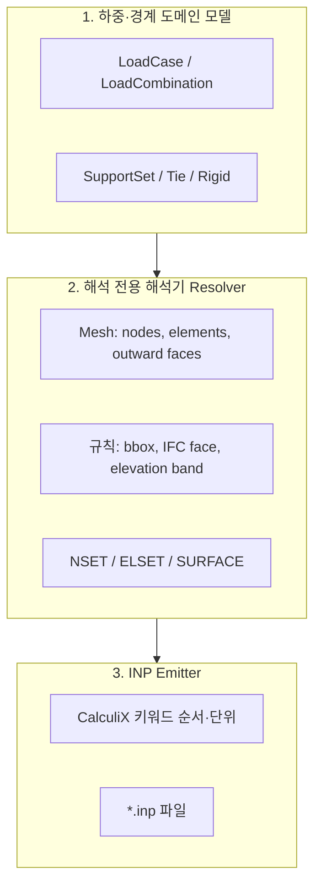

# 하중 정의 모델 · CalculiX INP 생성 · UI — 설계 연구

OpenBIM-Deflect 스파이크는 오늘 **`point_load_n` + `bc_mode` 문자열** 한 조합으로 `*CLOAD` 한 줄을 씁니다. **복합 구조·풍·지진·조합**으로 가려면 **하중을 데이터로 모델링**하고, **메쉬·경계와 결합해 해석 입력으로 “해석(resolve)”**한 뒤, **CalculiX 문법으로 “방출(emit)”**하는 **세 층**을 분리하는 것이 유지보수와 UI 확장에 유리합니다.

---

## 1. 현재 상태와 한계

| 항목 | 현재 (`write_ccx_inp_from_gmsh_mesh`) | 한계 |
|------|----------------------------------------|------|
| 지지 | `bc_mode`에 따른 최소 Z/Y 노드 집합 + `*BOUNDARY` 전 dof 고정 | 부분 고정·스프링·면 지지 없음 |
| 하중 | 단일 노드 `*CLOAD` 1개 | 분포하중·면압·중력장·다중 케이스 없음 |
| 단계 | `*STEP` / `*STATIC` 1개 | 하중조합·비선형·모달 없음 |
| 재료 | 단일 `*SOLID SECTION` | 부재별 재료·두께 방향 없음 |
| 기하 | C3D4 전체 `EALL` | 쉘/빔 요소 분기 없음 |

**연구 결론:** UI에서 “풍/지진”을 늘리는 것만으로는 부족하고, **동일한 내부 모델**을 백엔드가 받아 **INP로 컴파일**할 수 있어야 합니다.

---

## 2. 권장 아키텍처 (3층)

- **도메인 모델:** 사용자·IFC·UI가 말하는 언어 (케이스 이름, 풍압 kN/m², 지진 shears 등).
- **Resolver:** “Z=10m 이상 외기 면 노드”처럼 **기하+메쉬**에 의존하는 식별. 출력은 **노드/요소 ID 집합** 또는 **CalculiX SURFACE** 후보.
- **Emitter:** CalculiX 2.x 문법, `*INCLUDE`, 단위 일관성, STEP 분리.

이렇게 나누면 **단위 테스트**가 가능합니다: (1) JSON 스펙 → (2) 가짜 메쉬 → (3) 기대 INP 스냅샷.

---

## 3. 하중 도메인 모델 (버전드 JSON, 제안)

**원칙:** `version` 필드로 스키마 진화. 초기에는 **정적 선형**만; 모달/스펙트럼은 `analysis_type` 확장.

### 3.1 최상위: `AnalysisInputV1` (제안명)

| 필드 | 설명 |
|------|------|
| `version` | `1` |
| `coordinate_system` | `global` (IFC/메쉬 월드와 동일 가정) |

**뷰어·해석 좌표 단위:** 파이프라인(IfcOpenShell → Gmsh → INP)은 보통 **m** 좌표입니다. 같은 IFC를 **web-ifc**로만 보면 파일이 **mm**이면 정점이 1000배 큰 수로 나옵니다. 프런트 `IfcViewer`는 STEP 헤더의 `IFCSIUNIT`(LENGTHUNIT)을 읽어 로드된 메시에 `scale`을 곱해 **IFC 길이 → m** 로 맞추고, `fe_results`의 `x,y,z`(INP *NODE)와 **같은 미터법**으로 겹칩니다. 축 순서(x,y,z)는 그대로 두고 **스케일만** 맞춥니다.
| `load_cases[]` | 개별 하중 케이스 (DEAD, WIND_X, …) |
| `combinations[]` | (선택) 계수 조합 `1.4*DEAD + 1.4*WIND` |
| `supports` | 지지 규칙 목록 |
| `solver` | `static_linear` 등 |

### 3.2 `LoadCase` 종류 (단계적 도입)

| `type` | 의미 | Resolver 출력(목표) | CalculiX (개략) |
|--------|------|---------------------|-----------------|
| `nodal_force` | 노드 ID 또는 규칙 + 벡터 | `*CLOAD` 다중 | `*CLOAD` |
| `gravity` | 가속도 벡터 (0,0,-g) 등 | C3D4 부피×밀도×a → **등가 `*CLOAD`** (MVP 루핑) | CalculiX `*CLOAD` (본 구현) |
| `surface_pressure` | Pa 또는 kN/m², 면 필터 | 외피 삼각형 → 노드/면 하중 근사 | `*DLOAD` (facial) 또는 등가 노드군 |
| `line_load` | 선재(보) 분포·집중 하중 — **별도 설계** ([§7.2](#sec-7-2-line-seismic)) | (목표) 빔 ELSET | `*DLOAD` beam 등 |
| `seismic_static` | 등가 정지 지진(전단·층별 분배) — **별도 설계** ([§7.2](#sec-7-2-line-seismic)) | (목표) 층별 질량·대표 노드 | 다중 `*CLOAD` / 질량·모달 경로 |

**MVP 다음 스텝:** `nodal_force[]` 다중 + `supports[]` 다중 + `load_cases`별 `*STEP` (또는 한 STEP에 중첩하지 않고 케이스별 inp 분리 후 superposition은 후처리).

### 3.3 지지 `Support` (제안)

| `type` | 설명 |
|--------|------|
| `fix_nodes_rule` | `min_z`, `max_z_plane`, `bbox_face` 등 |
| `fix_dof` | `1,2,3` 또는 부분 `1`만 |

현재 `bc_mode`는 **`fix_nodes_rule` + 단일 `nodal_force` 휴리스틱**의 하드코딩 특수 경우로 볼 수 있습니다.

---

## 4. Resolver 설계 쟁점

1. **솔리드 C3D4만 있을 때 면압**  
   Gmsh 볼륨 메쉬의 **경계 삼각형**을 추출해 외법선 일치시키고, 각 삼각형에 압력 → **등가 노드하중**으로 분배(Lumped)하거나 CalculiX **face-based** 입력이 가능한지 버전별로 확인.

2. **“최고층 노드 하나” 휴리스틱**  
   단일 절점 하중은 **특이점(응력 발산)** 이므로 UI에 **경고**하고, 가능하면 **노드 집합(NSET)** 에 분산.

3. **IFC와 메쉬 ID 매핑**  
   `partition_ifc_elsets` 로 **병합 체적 메쉬**에서도 부재별 ELSET(MVP: 중심 vs AABB)을 부여할 수 있다. **정확한 면·볼륨 일치**는 Gmsh 다중 Physical Volume·STEP/BREP 등 후속 과제.

4. **단위**  
   도메인 모델은 **SI 권장** (N, m, Pa). UI는 kN 입력 → 변환 레이어.

---

## 5. CalculiX INP 생성 (Emitter) 체크리스트

| 순서 | 키워드 | 비고 |
|------|--------|------|
| 1 | `*HEADING` | 케이스·모델 버전 |
| 2 | `*NODE` | Gmsh 태그 유지 권장 (FRD 매칭) |
| 3 | `*ELEMENT` | C3D4 / 추가 타입 |
| 4 | `*NSET`, `*ELSET`, `*SURFACE` | Resolver 결과; 선택적으로 IFC 부재별 `*ELSET`(로드맵 4단계) |
| 5 | `*MATERIAL`, `*SOLID SECTION` | 다중 재료 시 ELSET 분할 |
| 6 | `*BOUNDARY` | 지지 |
| 7 | `*STEP` / `*STATIC` | 케이스별 분리 또는 `*INCLUDE` |
| 8 | `*CLOAD`, `*DLOAD`, `*GRAVITY`(해당 시) | |
| 9 | `*NODE FILE`, `*EL FILE` | 후처리와 일치 |

**조합:** CalculiX에서 `*STEP`을 여러 개 두거나, 전처리에서 `combinations`를展開해 등가 하중 한 번에 넣는 방식 선택 (구현 단순도 vs 표준 관행).

---

## 6. UI 정보 구조 (IA)

1. **탭/섹션: 지지**  
   - 프리셋 (최소 Z 전고정, …) + 고급: “면 선택(Three.js에서)”은 **메쉬 준비 후** 단계에서 활성화.

2. **탭/섹션: 하중 케이스**  
   - 목록 + 추가: 유형(노드력/중력/면압/등가지진).  
   - 각 행: 크기·방향·적용 규칙(슬라브 상면, Z>z0, 전체 외피 등).

3. **탭/섹션: 조합 (규정)**  
   - 행: `ULS 1.2D+1.6L` 등 계수 편집 → 백엔드가 조합 ID로 STEP 또는 합산.

4. **검증·피드백**  
   - “노드 1개 하중” 경고, 자유도 잠금 vs 하중 방향 모순 검사.

5. **저장 형식**  
   - 프로젝트 JSON (`AnalysisInputV1`)을 로컬 스토리지 또는 `POST /api/v1/analysis-spec` (미래).

프론트 타입 스켈레톤: [`frontend/src/analysis/loadModel.ts`](../frontend/src/analysis/loadModel.ts).

---

## 7. 구현 로드맵 (권장 순서)

| 단계 | 내용 | 산출물 |
|------|------|--------|
| **0** | 현状 유지 | `bc_mode` + 단일 `load_z` |
| **1** | 다중 `*CLOAD` + 다중 NSET (규칙 기반) | `AnalysisInputV1` 부분 구현, Emitter v1 |
| **2** | 케이스별 `*STEP` + FRD 파일명 분리 또는 라벨 | **구현됨:** `load_cases` 순서대로 `*STEP` 다중; FRD는 단일 파일·블록 순서; `fe_results.json` 에 `load_steps[]` + 루트 필드는 **마지막 스텝** (VTK 호환). 예: [`sample/analysis_input_v1_two_steps_example.json`](../sample/analysis_input_v1_two_steps_example.json) |
| **3** | 경계면 추출 + 등가 면압 | **MVP 진행됨:** `surface_pressure(kind=exterior)` 를 C3D4 외곽 삼각면에 분배해 등가 절점하중(`*CLOAD`) 생성. 선택 `normal_max_tilt_deg`: 법선–+Z 각 θ에 대해 \|θ−90°\| ≤ 허용각(°)인 면만 적용(수직 외벽 위주); 맞는 면이 없으면 오류. 필터로 일부면만 쓰면 폐곡면이 아니어서 **합력이 0이 아닐 수 있음**(풍하중 등 의도적 모델링). |
| **4** | IFC GUID ↔ ELSET | **MVP 진행됨:** 쿼리 `partition_ifc_elsets=true`(CLI `--partition-ifc-elsets`) 시 병합 체적 C3D4 각각을 **사면체 무게중심 ∈ 부재 AABB**(ε 팽창, 겹침 시 **최소 부피** AABB)로 ELSET 할당. INP 는 부재별 `*ELEMENT`·`*SOLID SECTION`, 산출물 `ifc_elset_map.json`. Gmsh 다중 볼륨·정확 면 매핑은 후속. |
| **5** | 조합 규정 + 문서화 | **MVP 진행됨:** `combinations[]` 에 `factors: { case_id: 계수 }` 선형 중첩 → 추가 `*STEP`·등가 `*CLOAD`. `combinations[].id` 는 `load_cases[].id` 와 중복 불가. 등가 하중이 전부 0이면 오류. **폼에서 조합 행 편집 가능.** 예: [`sample/analysis_input_v1_with_combination.json`](../sample/analysis_input_v1_with_combination.json) |
| **6** | 체적 중력 (`gravity`) | **MVP 진행됨:** `loads[]` 에 `type: gravity`, `acceleration` [m/s²], `case_id`. C3D4 부피×밀도×가속도를 사면체별 **1/4 루핑 등가 `*CLOAD`**. 밀도는 선택 필드 `material_density_kg_m3` 또는 API 쿼리 `density_kg_m3`(기본 7850). 예: [`sample/analysis_input_v1_gravity.json`](../sample/analysis_input_v1_gravity.json) |
| **7** | 폼에서 중력 편집 | **MVP 진행됨:** `AnalysisSpecForm` 에 **+ 중력** 행(ax,ay,az), 선택 `material_density_kg_m3` 입력(비우면 패널 `density` 쿼리) |

### 7.1 프론트·백엔드 구현 범위 (스냅샷)

| 구분 | 내용 |
|------|------|
| **백엔드** | `backend/app/analysis/load_spec_v1.py` 모듈 독스트링 — 구현된 필드 vs 스켈레톤-only (`gravity`·`material_density_kg_m3` 포함) |
| **프론트 타입** | `frontend/src/analysis/loadModel.ts` 파일 헤더·각 미구현 인터페이스 주석 |
| **분석 패널 UI** | `AnalysisSpecForm` — 하중 케이스 행 + **하중 조합 행**(케이스별 γ 계수) + `nodal_force`·`surface_pressure`·**`gravity`** 행(선택 `material_density_kg_m3`); 그 외는 JSON 모드 |
| **결과 뷰** | `fe_results.load_steps` 가 있으면 스텝 선택 → VTK·요약에 선택 스텝 반영 (`feResultsView.ts`) |

### 7.2 별도 설계 단계: `line_load` · `seismic_static`

로드맵 **0~7**은 **병합 체적 C3D4** + `static_linear` + 등가 절점 `*CLOAD`(또는 동일 경로의 조합) 안에서 동작한다. 아래 두 하중 유형은 **요소 타입·질량 정의·규정(코드) 입력**이 함께 바뀌므로, JSON 필드 몇 줄을 추가하는 수준이 아니라 **전제 조건을 고정한 뒤** `version` 또는 `analysis_type` 분기와 함께 구현하는 것이 안전하다.

#### `line_load` (선 하중)

| 항목 | 설명 |
|------|------|
| **현재 격차** | 파이프라인은 **체적 사면체 메쉬만** 생성한다. CalculiX **빔 `*DLOAD`·`BEAM SECTION`** 은 **1D 요소**(B31/B32 등)와 ELSET이 필요하다. |
| **설계에서 정할 것** | IFC `IfcBeam` / `IfcMember` 를 **별도 1D 메쉬**로 둘지, 3D solid 위에 **임베디드/표면 투영**으로 근사할지, 단면·국부좌표·편심을 어디까지 지원할지. |
| **Resolver 목표** | “어느 선(곡선)의 어느 구간에 kN/m”을 **노드 ID 또는 빔 요소 ID**로 변환. |
| **Emitter 목표** | `*DLOAD` (분포) 또는 허용되는 경우 등가 `*CLOAD`. |
| **권장 진행** | 소규모 빔-only 프로토타입(INP 수동·Gmsh 1D) → 스키마 초안 → 본 파이프라인과의 **기하 병합 정책** 합의. |

#### `seismic_static` (등가 정지 지진)

| 항목 | 설명 |
|------|------|
| **현재 격차** | “베이스 전단·층별 힘”은 **층(스토리) 단위 질량**과 **대표 자유도(전단 중심·편심)** 가 필요하다. C3D4 전체 질량만으로는 **규정이 요구하는 분배**와 자동으로 일치하지 않는다. |
| **설계에서 정할 것** | 층 경계 정의(IFC `IfcBuildingStorey` vs 높이 밴드), DEAD/LIVE 계수를 포함한 **층별 질량 표**, 한 방향 전단만 vs 양방향+토션, **스펙트럼/모달**으로 갈지 **정적 등가만** 할지. |
| **Resolver 목표 (예시)** | (초간단 MVP) 층별 질량중심에 가장 가까운 **단일 노드**에 `*CLOAD` 누적 — 응력 검증용이 아니라 **워크플로 스파이크**용으로 범위 고지. (본격) `*MASS` 노드·모드 추출·`analysis_type` 확장. |
| **규정** | KDS·건축구조기준 등 **계수·스펙트럼 값은 도메인 데이터로 받되**, “규정 자동 선택”은 스코프 밖으로 명시하는 것이 좋다. |
| **권장 진행** | 층 질량 표 + 단방향 전단 **수동 검증 가능한 최소 스키마** → FRD/조합과의 호환 → 필요 시 `version: 2` 또는 `analysis_type: response_spectrum` 검토. |

#### 구현 전 체크리스트 (공통)

1. **요소 카탈로그:** C3D4만 / C3D4+빔 / 쉘 추가 여부.  
2. **질량 소스:** 중력과 동일 밀도 통합 vs 층별 표 vs IFC 속성.  
3. **검증:** 단위 테스트용 **고정 메쉬 스냅샷** + 기대 합력·기대 INP 스니펫.  
4. **UI:** 규정 숫자는 “고급/JSON”으로 두고, 기하 규칙만 폼에 노출할지.

**코드 위치:** `backend/app/analysis/load_spec_v1.py` 독스트링에 “미구현”으로만 표기되어 있으며, 필드 추가는 위 결정 후 진행한다.

---

## 8. 관련 문서·코드

- 스파이크 INP: [`scripts/spike/pipeline_ifc_gmsh_ccx.py`](../scripts/spike/pipeline_ifc_gmsh_ccx.py) — `write_ccx_inp_from_gmsh_session` (AnalysisInputV1 시 케이스별 `*STEP`, 없으면 레거시 `bc_mode`)
- API 쿼리: [`docs/API.md`](./API.md) — `boundary_mode`, `load_z`
- 타입 스켈레톤: [`frontend/src/analysis/loadModel.ts`](../frontend/src/analysis/loadModel.ts)

---

## 9. 요약

- **하중·지지는 “문자열 모드”가 아니라 버전드 구조화 스펙**으로 가져가고, **메쉬에 묶는 Resolver**와 **CalculiX Emitter**를 분리한다.
- UI는 **케이스·조합·규칙**을 편집하고, 백엔드는 **검증된 스펙 → INP**만 담당한다.
- 단기 구현은 **다중 노드력 + 다중 STEP**이 비용 대비 효과가 크다. **`line_load`·`seismic_static`** 은 [§7.2](#sec-7-2-line-seismic) 에서 요소·질량·규정 범위를 정한 뒤 별도 이슈로 진행한다.

이 문서는 **연구·설계 스냅샷**이며, 구현 시 이슈/PR에서 스키마 `version`을 올리며 갱신합니다.
