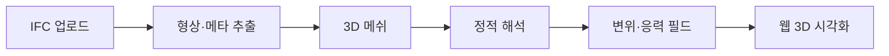

# 구조 해석(휘어짐 테스트)을 위한 핵심 오픈소스 파이프라인

이 파이프라인은 크게 **데이터 추출 → 메쉬 생성 → 해석(시뮬레이션) → 결과 시각화**의 **4단계**로 구성됩니다. 단계마다 연산이 무겁고 라이브러리 연동이 많으므로, **파이썬(Python) 기반 백엔드**로 묶는 구성이 가장 이상적입니다.

---

## 파이프라인 개요

| 단계 | 요약 |
|------|------|
| 1 | BIM(IFC)에서 객체·기하·재질 정보 추출 |
| 2 | 솔리드를 유한요소용 3D 메쉬로 분할 |
| 3 | 하중·지지 조건을 넣고 변위·응력 계산 |
| 4 | 브라우저에서 변형 형상·히트맵 표시 |

---

## 1. BIM 데이터 파싱 및 형상 추출 (IfcOpenShell)

**역할:** IFC 파일에서 기둥, 보(Beam), 슬래브 등 **객체를 구분**하고, **기하학적 형상**과 **재질 정보**(콘크리트, 철골 등)를 추출합니다.

**추천 라이브러리: [IfcOpenShell](https://ifcopenshell.org/) (Python)**  
BIM 형상을 비교적 안정적으로 다루며, 솔리드 기반 워크플로로 **STEP/IGES 등으로의 변환**과 연계하기 좋습니다. MVP에서는 단일 부재로 범위를 좁혀 이 단계의 복잡도를 먼저 검증합니다.

---

## 2. 해석용 메쉬(Mesh) 생성 (Gmsh)

**역할:** 추출된 3D 솔리드를 수많은 작은 요소(유한요소)로 쪼갭니다. 요소가 공간을 채워야 **휘어짐·응력**을 의미 있게 계산할 수 있습니다.

**추천 라이브러리: [Gmsh](https://gmsh.info/)**  
오픈소스 3D 유한요소용 메쉬 생성기이며 **Python API**를 제공합니다. 복잡한 건축 형상도 설정에 따라 잘게 분할할 수 있습니다.

---

## 3. 구조 해석 및 휘어짐(Deflection) 계산 솔버

**역할:** 사용자가 입력한 **하중**(예: 보 중앙에 큰 수직 하중)과 **지지 조건**(예: 양끝 고정)을 바탕으로, 변위(처짐)와 응력을 **물리 모델**에 따라 계산합니다.

**추천 라이브러리 (택1 또는 단계별 도입):**

| 도구 | 특징 |
|------|------|
| **[CalculiX](http://www.calculix.de/)** | Abaqus와 유사한 입력 관례를 쓰는 **강력한 오픈소스 3D 구조 해석 엔진**. 건축·기계 FEA 파이프라인과 궁합이 좋습니다. |
| **[FEniCS](https://fenicsproject.org/)** | 파이썬에서 편미분방정식 기반 모델을 세우기 좋아, **커스텀 물성·이론**을 실험할 때 유리합니다. |

프로젝트 README의 기본 스택은 **CalculiX**를 전제로 한 경우가 많으며, 난이도·유지보수에 따라 FEniCS를 보조 또는 연구 경로로 둘 수 있습니다.

**하중 정의·INP 생성·UI 설계(연구):** 다중 하중·조합·면압으로 확장할 때의 **도메인 모델 / Resolver / Emitter** 분리와 CalculiX 키워드 매핑은 [`LOAD-MODEL-AND-INP.md`](./LOAD-MODEL-AND-INP.md) 를 참고하세요.

---

## 4. 시각화 (VTK.js / Three.js)

**역할:** 계산된 **휘어짐(변위)** 데이터를 받아, 응력이 큰 곳은 **붉은색**, 작은 곳은 **푸른색** 등으로 보여 주는 **히트맵**과, **실제로 휘어진 듯한 3D 형상**(과장 스케일 포함)을 브라우저에 렌더링합니다.

**추천 라이브러리:**

| 도구 | 특징 |
|------|------|
| **[VTK.js](https://kitware.github.io/vtk-js/)** | 과학·공학 **스칼라/벡터 필드** 시각화에 특화. 응력·변위 필드를 메쉬에 입히기에 적합합니다. |
| **[Three.js](https://threejs.org/)** | 장면·카메라·기하 표현의 기본층. IFC 기하 **미리보기**, 간단한 변형 메쉬 표현에 널리 씁니다. |

실무적으로는 **Three.js로 장면·모델**, **VTK.js로 해석 결과 필드**처럼 역할을 나누는 구성이 흔합니다.

**본 저장소(프론트 스냅샷):** IFC 미리보기와 동일한 Three.js 씬 위에 `fe_results` 샘플 노드를 **포인트(버텍스 컬러)** 로 오버랩합니다. 별도 VTK.js 뷰포트는 쓰지 않습니다(번들 단순화).

---

## 핵심 기능 구현 프로세스 시나리오

아래는 사용자 관점에서 **한 번의 휘어짐 테스트**가 돌아가는 흐름입니다.

1. **모델 업로드**  
   사용자가 웹 브라우저에 BIM(`.ifc`) 파일을 업로드합니다.

2. **부재 선택**  
   3D 화면에서 시험할 **특정 보(Beam)** 또는 **바닥(Slab)** 등을 클릭해 선택합니다.

3. **조건 입력**  
   UI 패널에서 예를 들어 **양끝 고정(Fixed)** 지지 조건을 설정하고, 부재 중앙에 **수직 하중(예: 50 kN)** 을 가합니다.

4. **백엔드 연산**  
   - 서버에서 선택된 부재 형상을 **Gmsh**로 메쉬합니다.  
   - **CalculiX**(또는 채택한 솔버)가 하중·경계 조건에 따른 **변위(Displacement)**·응력을 계산합니다.

5. **결과 확인**  
   부재가 휘어진 모습이 시각화되고, **최대 처짐량**(예: 15 mm) 등이 화면에 함께 표시됩니다.

---

## 관련 문서

- MVP 범위·UI·완료 기준: [`MVP-v1.0-SPEC.md`](./MVP-v1.0-SPEC.md)
- 파이프라인 기준 폴더 구조 연구: [`PROJECT-STRUCTURE.md`](./PROJECT-STRUCTURE.md)
- 프로젝트 개요·README 스택: 루트 [`README.md`](../README.md)
